# Unreal Engine 5 Course

That's my journey of learning Unreal Engine 5. Each chapter is linked to a task from the roadmap I follow and contains a brief description of the way I tackled that task.

## Junior level

### Setup

At first, I set up my project using the First Person Shooter template. At the time, I was working with Unreal Engine 5.3.2 and Visual Studio 2022 with version 17.8.3.

### Version Control

I decided to use Git without LFS as a Version Control System for this project. I used mingw64 to make it easier to input Git commands. I connected Git to Unreal and tried to see a diff between two versions of a file:

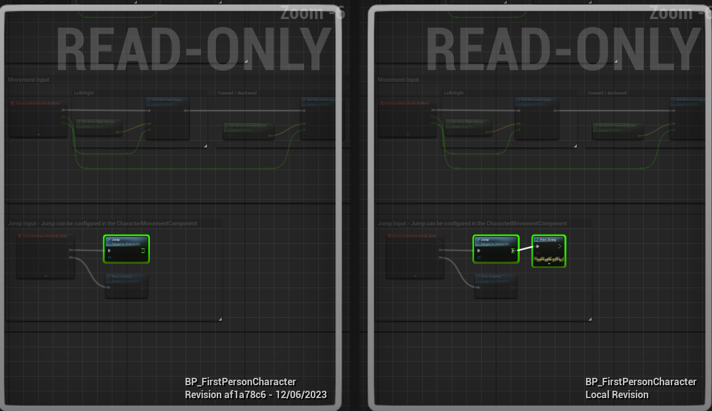

### Basic Classes

I changed all boxes on my level so that they instanced a class with HP field. I also added ammo pickup cubes and bullet count for the weapon:

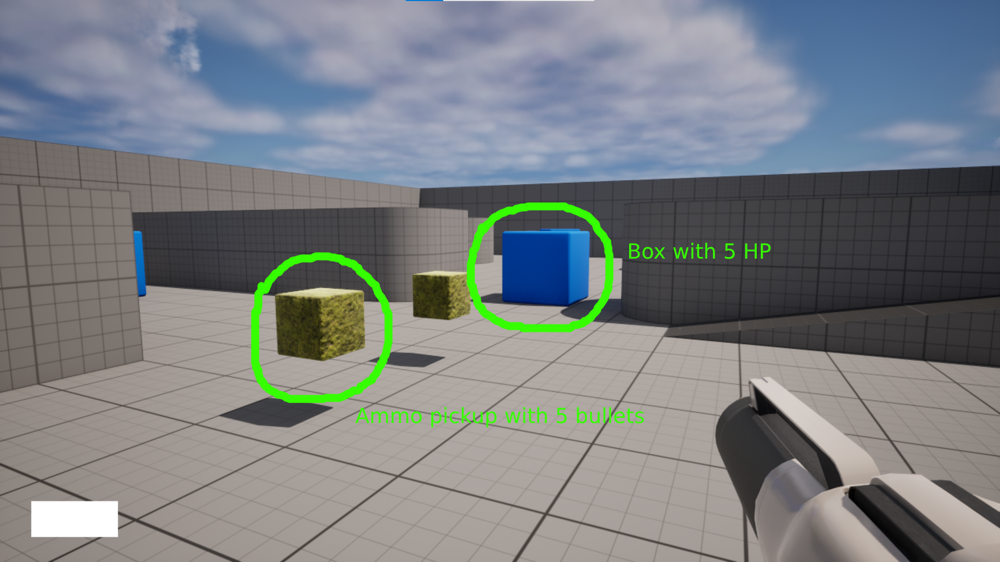

### Unreal Macros

I moved HP logic to a custom component written in C++ (HealthComponent) and used unreal macros to make HP editable in the range from 0 to 100:

```c++
UPROPERTY(BlueprintReadWrite, EditDefaultsOnly, Category = "Default", Meta = (ClampMin = "0", ClampMax = "100"))
int32 HealthPoints;
```

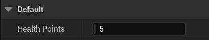

### Basic UI

I created a basic UI for my game - a Pause Menu which I could open and close by using "E" button. The logic was added to pause the game when this menu was opened.

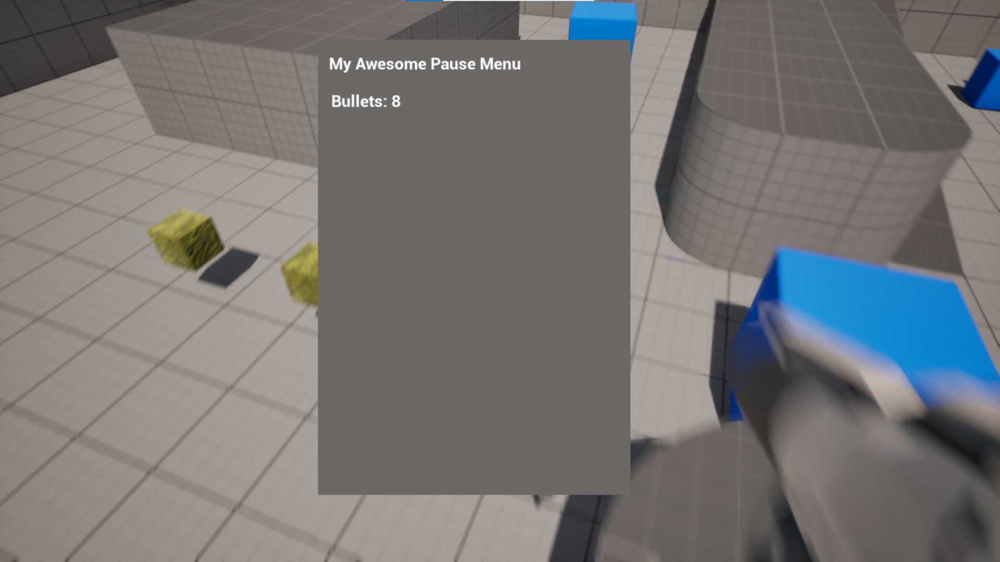

### Pure Functions

As one article elegantly states "Pure nodes are executed on demand whenever their output is required by an impure node for it to execute". I added 2 pure functions (one with const C++ modifier, another - with BlueprintPure UE modifier). Also I created a logic that could work only with pure functions:

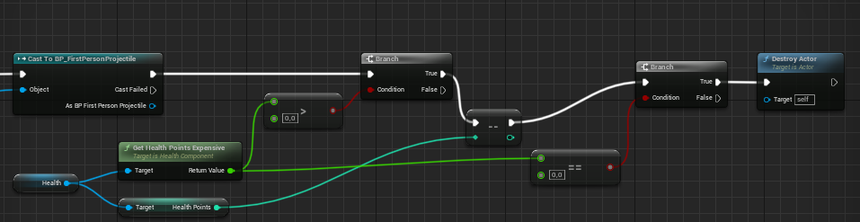

The GetHealthPointsExpensive function was called both before and after the value of HP was decreased. If the output was cached, this logic wouldn't work. However, because the logic called this function every time it needed an output, it was executed twice and gave correct results:


### Bind Widgets

I created a C++ class that's inherited from UUserWidget and added two pointers to UI widgets. One of them, AmmoCounter, had modifier BindWidget, the other one, AmmoImage, had modifier BindWidgetOptional. I created a BP class inherited from the C++ class and added an AmmoCounter text block. Without it, the blueprint compilation didn't finish successfully. However, AmmoImage was optional, thus I didn't need to create this widget in BP.

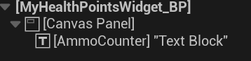

### Enhanced Input

Added "IA_ThrowGrenade" to accommodate for the mechanic of throwing a grenade.

### Grenade mechanic

I created a grenade mechanic which allowed player to aim grenade throw while holding "IA_ThrowGrenade" and throw grenade when this button input was released.

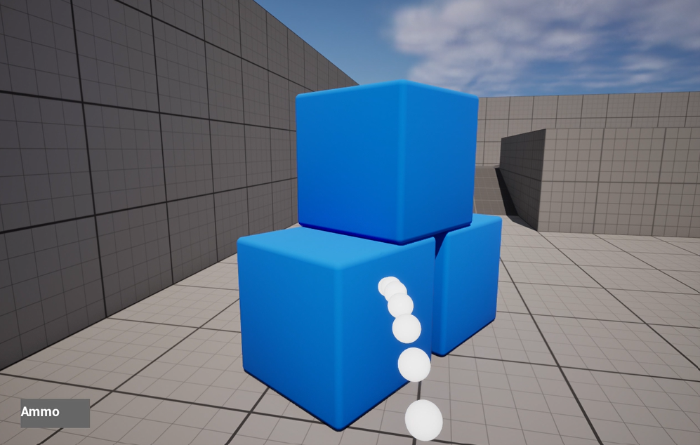

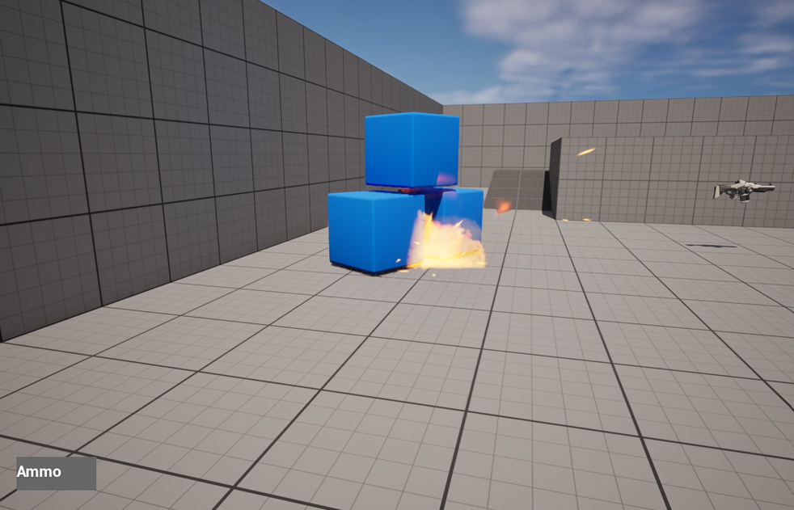

Grenade explosion used a radial impulse to spread force within a radius. This force influenced physics bodies and sent them flying! Explosion also came with a simple VFX based on standard content. If force was applied, objects were dealt damage.

Grenades' shockwave was blocked by walls.


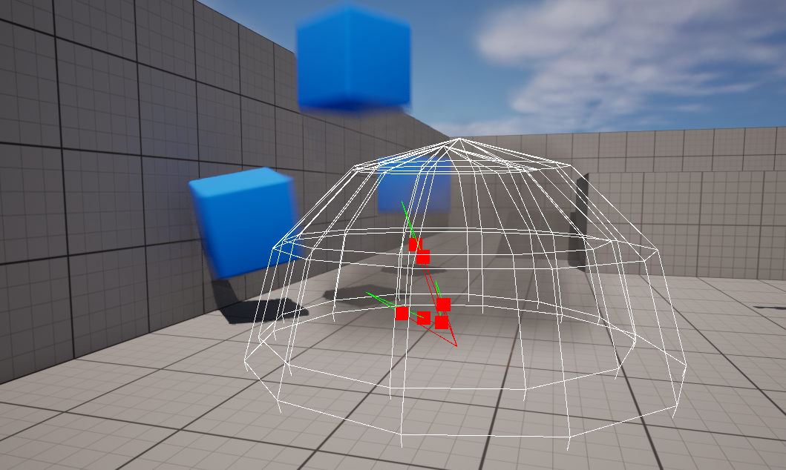

Grenade trail visualization was added afterwards:

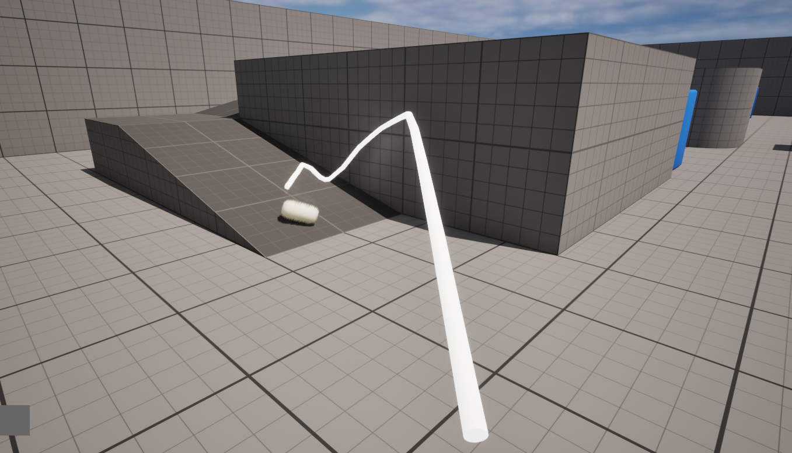

### Blueprint virtual machine

To investigate how BVM (Blueprint Virtual Machine) works I read through the code and visited these two articles: [Anatomy of the Unreal 4 blueprint virtual machine](https://ikrima.dev/ue4guide/engine-programming/blueprints/bp-virtualmachine-overview/), [Discovering Blueprint VM (Part 2)](https://intaxwashere.github.io/blueprint-part-two/).

BVM works in a similar way to JVM - it uses operand stack (it's not the same as the OS stack) to activate zero-address instructions. This instructions use values that are put on stack to perform a limited set of basic actions such as creating a local variable,  jumping to a place in compiled code for BVM. These instructions can be found in the Unreal Engine code in `enum EExprToken`.

One of the features of BVM is stack frame. It allows to call functions, remember functions states, fetch instructions and find corresponding native function (i.e. C++ functions). Stack frames are put on the operand stack one after another (probably they follow some protocol which allows them to put function arguments in a way that can be read by the next stack frame).

To go deeper into details of BVM implementation let's go to the scheme below:

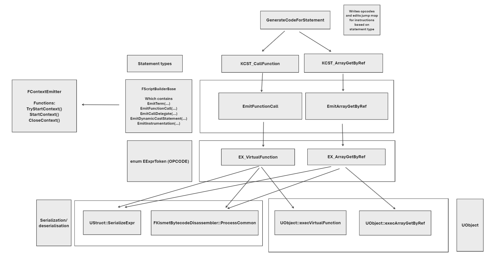

This scheme illustrates connections between different C++ functions and values. If we look at the bottom of this picture we can notice that opcodes are associated with UObject functions. This is interesting, looks like UObject is a unit of BVM execution, in other words - we cannot execute an instruction in a vacuum, it will always be connected to a UObject. For that reason if we want a support from BVM features we should construct our code in Unreal Engine projects based on UObject functionality, not custom C++ code and structures.

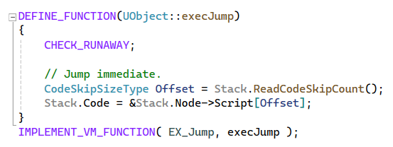

In the left bottom part you can notice a block with serialization/deserialization process.

If we look at the top of the scheme we can see that `GenerateCodeForStatements` can transform terms into opcodes. It also fills `JumpTargetFixupMap` so that jump targets (jump is a direction of the execution flow in another part of the program) can be later set after all code is generated.

As I understand `GenerateCodeForStatements` is connected to the functions and classes compilation process. This process is described in a separate part of code and consists of multiple steps:

- `FKismetCompilerContext::PrecompileFunction` prunes the function graph, schedules executions of each node, creates UFunction without script code
- `FKismetCompilerContext::CompileFunction` generates executable code
- `FKismetCompilerContext::PostcompileFunction` is called after all functions had CompileFunction called. It includes working with cross-references.

These steps are all a part of `FKismetCompilerContext::CompileFunction` which contains other interesting operations. For example, it generates `LinearExecutionList` out of graph nodes that are just lists of connections and dependencies.

Unreal Engine Editor (UnrealEd in code) has some useful features that are supported in BVM. For example, to operate with breakpoints there is an opcode-related function `UObject::execBreakpoint`. There is also a `FKismetDebugUtilities::OnScriptExecution` which can break execution, show script execution error message, record execution information in trace log, do something with node stepping (it's when you go inside a function called in another function that you are viewing).

To conclude, BVM is a complex system that includes

- compilation of functions out of blueprint graph to create operation codes
- execution of operation codes
- debugging functionality connected to Unreal Engine Editor
- storing operation codes

### Dynamic Stairs

My dynamic stairs blueprint used construction script to create stairs with parametrized height and width between two arbitrary points. The benefit of using construction script was that I could see the results of generation right in the editor. So, every change I made was visualized. The negative side of this approach was that runtime cost increased as the generation was not precalculated but rather computed during the game.

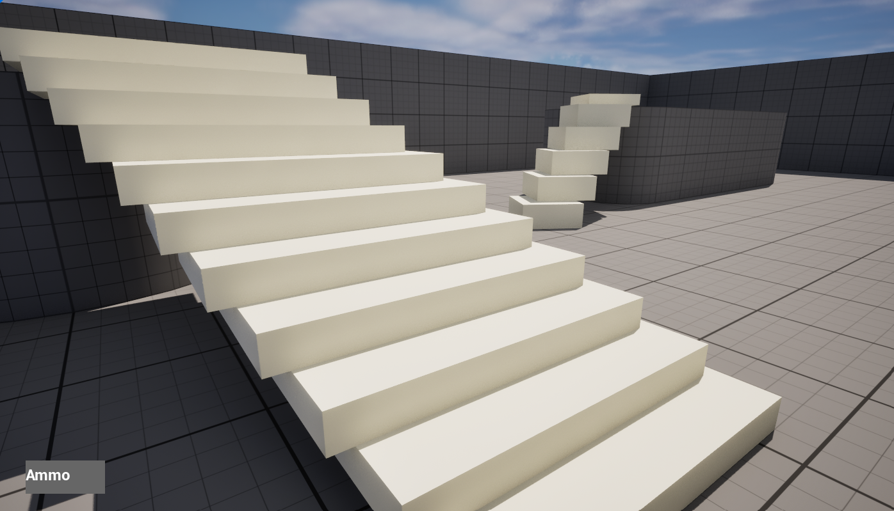

The code below presents the algorithm implementation:

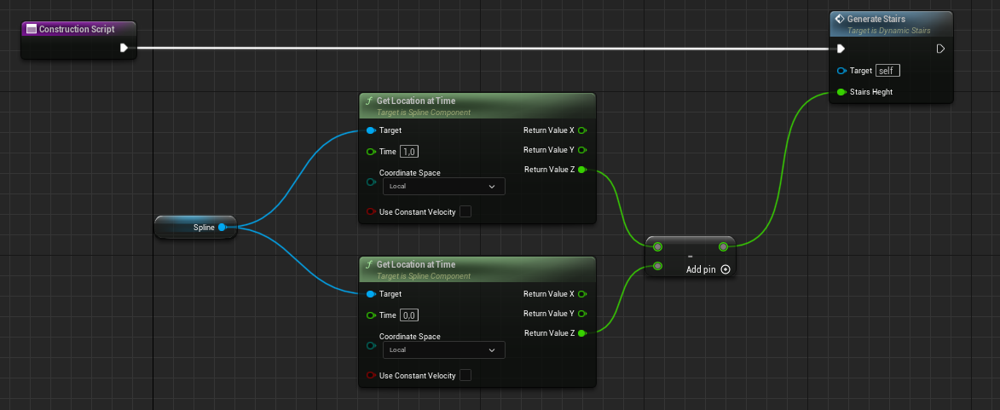

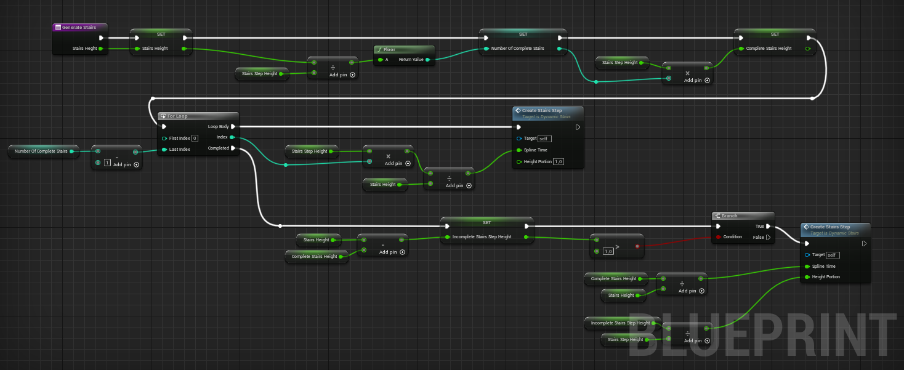

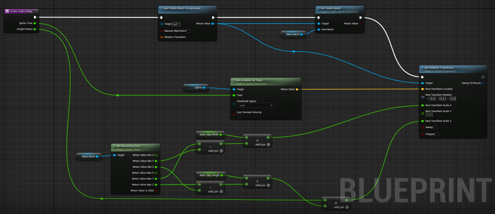

### Configs and Debug console

To change game configurations I used 3 approaches:

- Using FAutoConsoleVariableRef to change values from consol
- Changing ini files (for example, DefaultGame.ini)
- Adding functions with "exec" specifier

I used FAutoConsoleVariableRef to connect Unreal Engine config system with my global C++ value. This value was checked when player tried to shoot from a gun, allowing them to shoot infinitely.

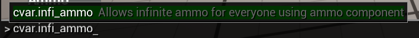

DefaultGame.ini was used to allow infinite health for boxes. I could edit a value from a file like this to change whether this cheat was turned on:

```ini
[CustomVariables]
InfiniteHealth=False
```

The last thing was exec specification for UFUNCTION that allowed some classes to execute member functions when a command was printed in command line interface. I created a custom UCheatManager with a function that reloaded DefaultGame.ini on fly.

```C++
UFUNCTION(exec)
void ReloadGameConfig()
{
	GEngine->AddOnScreenDebugMessage(-1, 2.0f, FColor::Yellow, TEXT("Reloading game config"));
	FString fileName = GGameIni;
	GConfig->LoadGlobalIniFile(fileName, *GGameIni, NULL, true);
}
```

Without this function the reloading of a DefaultGame.ini required a reloading of the whole project.

### Save/Load Game

In this task I improved Pause Menu UI to support save and load buttons. By default, load game button was disabled, but it got enabled once there was an available save.

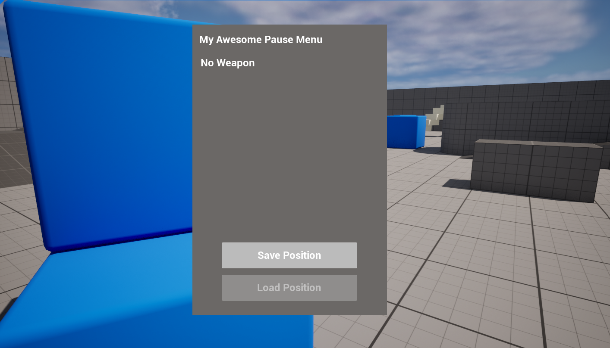


Loading the game allowed player to teleport to the location the player occupied when save button was pressed. It's just a simple transform change, but in general I could save any data and apply any logic to it.

I acknowledged that it was better to use asynchronous saving and loading, which meant that I couldn't use sequential logic to enable load game button once the save button was clicked. Instead I needed to use event dispatchers.

Let's discuss how this approach was organized. When a save button was clicked the logic executed an asynchronous save operation. Once it's successfully completed, the dispatcher event was called and handled by HUD. This handle enabled a load button allowing player to load the saved position. A similar logic was executed when player started the game - during the load of the game, if it was successful, the dispatcher was called, and afterwards our handle enabled the load button. The saved data was associated with a save slot called Default:

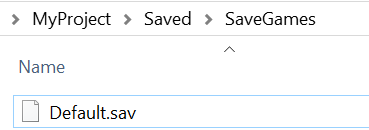

I also added a boolean that stored whether it was possible to enable a load button. This boolean could be accessed any time, so even if the dispatcher broadcasting was missed, HUD could still  initialize a load button in a valid state. It's actually a good example of temporal decoupling.

### Visual Debugging

Visual Logger can be used to log information about objects and display it visually. In this project I used it to capture locations where bullets (projectiles) hit:

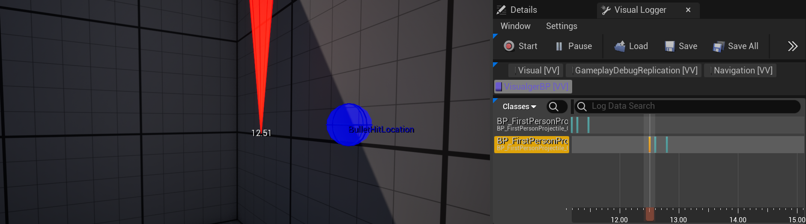

Locations were captured during the projectile hitting logic execution. These locations could be seen in a dedicated window. They could also be replayed so that I could see how a scene have changed through time. Logger's information was accessible in both editor mode and play mode.

### Data-Driven Design

Unreal Engine provides a way to use tables in game which can be useful for many design goals. I used this tool to store different weapon configurations. Each weapon had a name tag and this tag name was used to set ammo count when the weapon was picked up based on data table entry.

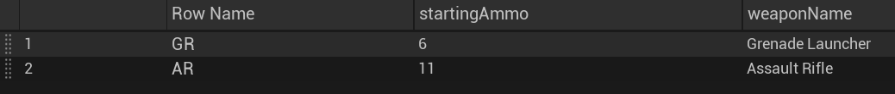

### Packaging

I tried two ways of packaging the project - "Package Project" button and "Project Launcher":

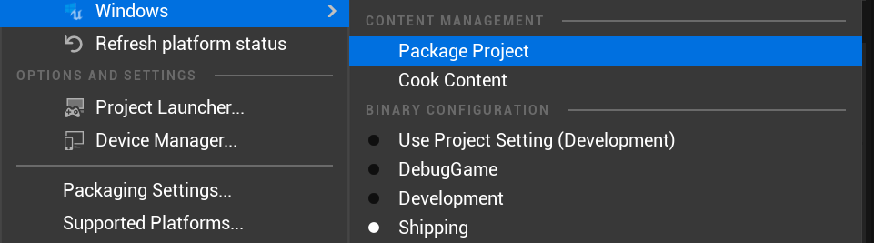

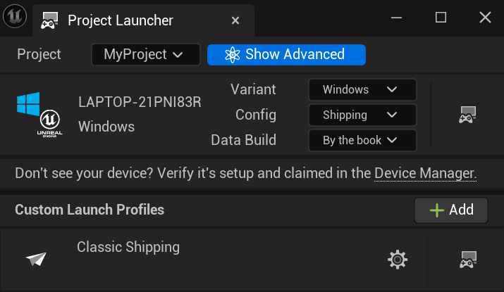

The game was successfully packaged for Win64.

## Middle level

### Advanced Game Mechanics

To implement an advanced game mechanic I chose to add a gravity mode to the existing gun. I also added UI to show which gun mode was used ("shooting" or "gravity changing").

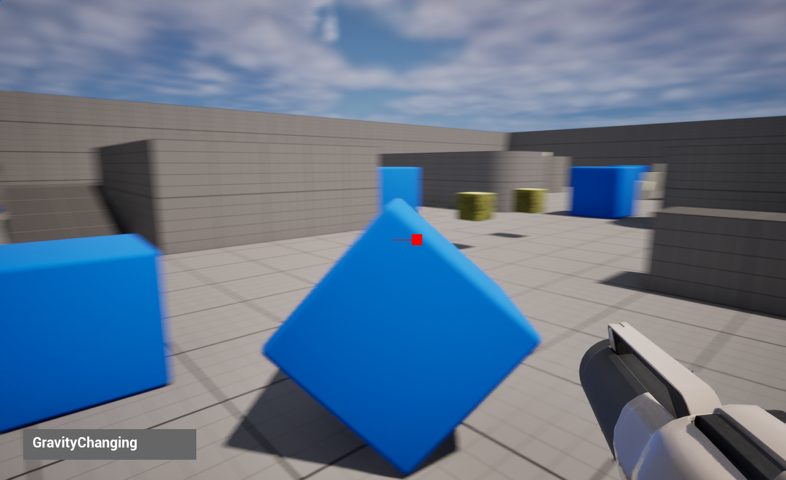

UI was implemented in a simple event-driven way - it listened to an event located in player character and reflected it's changes based on variables dispatched by this event. Gravity gun implementation was based on the usage of physics handle component similar to [the way described in this video](https://danny-padron09.medium.com/using-the-physics-handle-to-grab-objects-in-unreal-70ec9e5382f4). It's important to note that the way this gravity gun was designed was different from Half Life. Namely, the object was not rotated to face the player, instead the object was just touched by a virtual hand, so to say.
