# Unreal Engine 5 Course

That's my game on Unreal Engine 5.

### Setup

I used First Person Shooter template to create my project.

### Version Control

This project uses Git VCS without LFS.

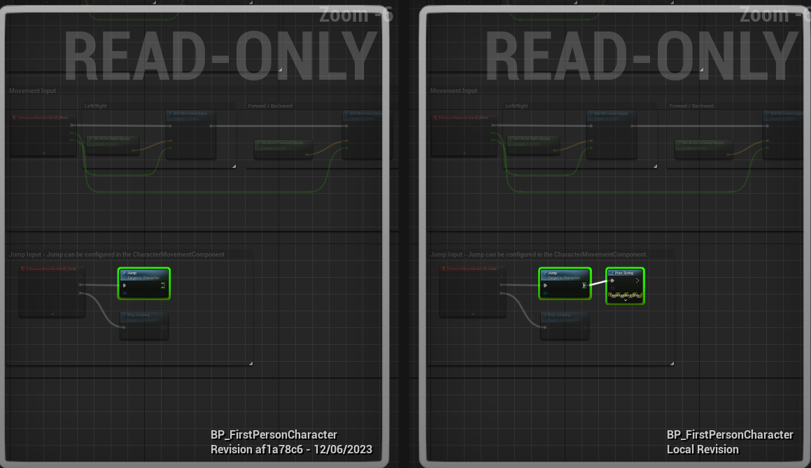

### Basic Classes

I changed all boxes on my level to instance a class with HP. I also added ammo pickup cubes, bullet count for the weapon.

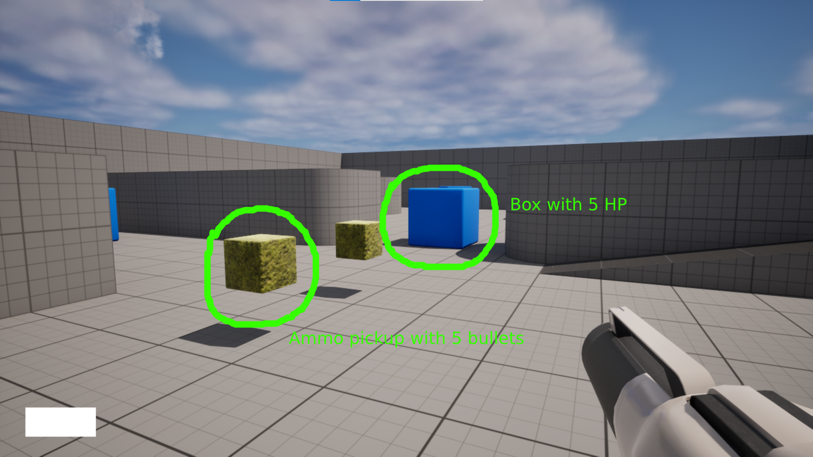

### Unreal Macros

I moved HP logic to a custom component written in C++ (HealthComponent) and used unreal macros to make HP editable in the range from 0 to 100.

```c++
UPROPERTY(BlueprintReadWrite, EditDefaultsOnly, Category = "Default", Meta = (ClampMin = "0", ClampMax = "100"))
int32 HealthPoints;
```

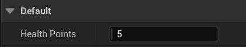

### Basic UI

My game has basic UI and UI for pause menu. Pause mechanic also works (you can pause the game using "E" button).

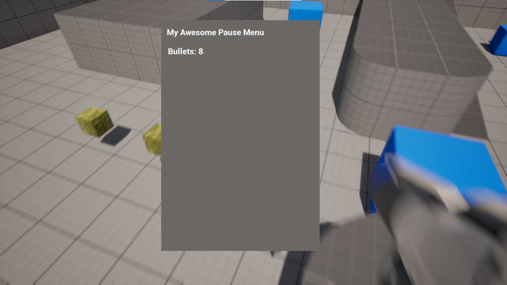

### Pure Functions

As one article elegantly states "Pure nodes are executed on demand whenever their output is required by an impure node for it to execute". I added 2 pure functions (one with const C++ modifier, another - with BlueprintPure UE modifier). Also I created a logic that can work only with pure functions:

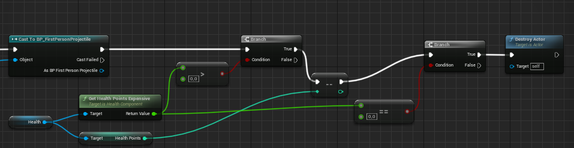

The GetHealthPointsExpensive function is called both before and after the value of HP is decreased. If the output was cached, this logic wouldn't work. However, because we call this function every time we need an output, it is executed twice and gives correct results.


### Bind Widgets

I created a C++ class that's inherited from UUserWidget and added two pointers to UI widgets. One of them, AmmoCounter, has modifier BindWidget, the other one, AmmoImage, has modifier BindWidgetOptional. I created a BP class inherited from the C++ class and added an AmmoCounter text block. Without it, the blueprint compilation doesn't finish successfully. However, AmmoImage is optional, thus I didn't need to create this widget in BP.

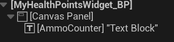

### Enhanced Input

Added "IA_ThrowGrenade" to accommodate for the mechanic of throwing a grenade.

### Grenade mechanic

I created a grenade mechanic which allows player to aim grenade throw while holding "IA_ThrowGrenade" and throw grenade when this button input is released.

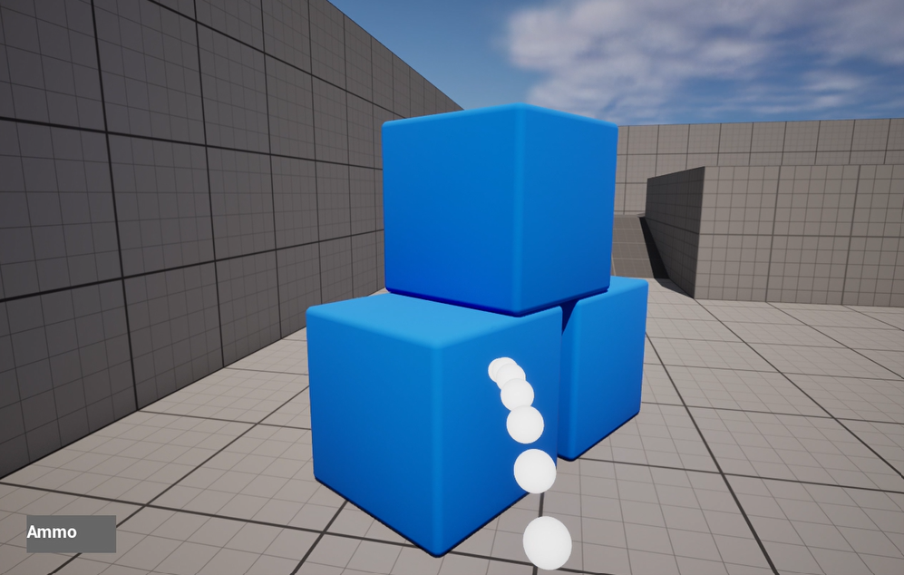

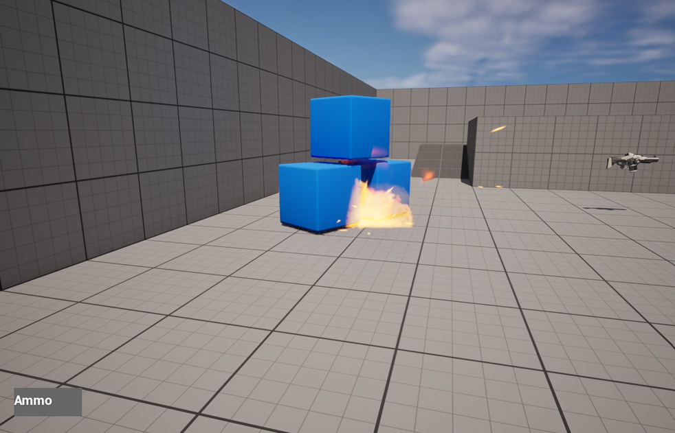

Grenade explosion uses a radial impulse to spread force within a radius. This force influences physics bodies and send them flying! Explosion also comes with a simple VFX from standard content. If force is applied, objects are dealt damage.

Grenades' shockwave is blocked by walls.
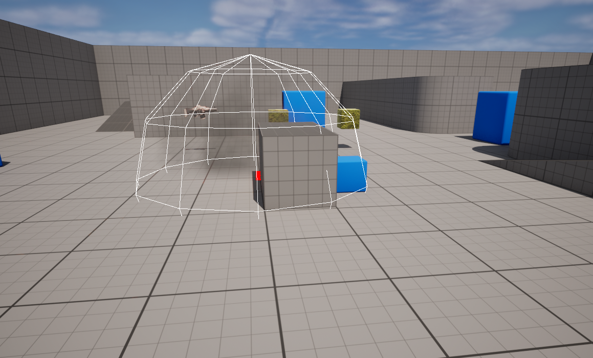

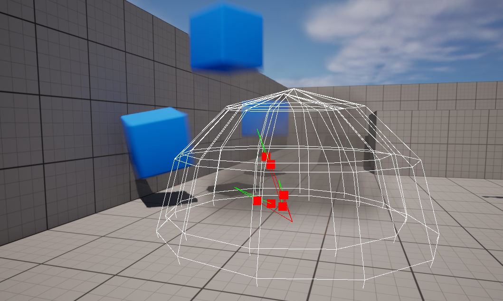

Grenade also has a trail visualization.

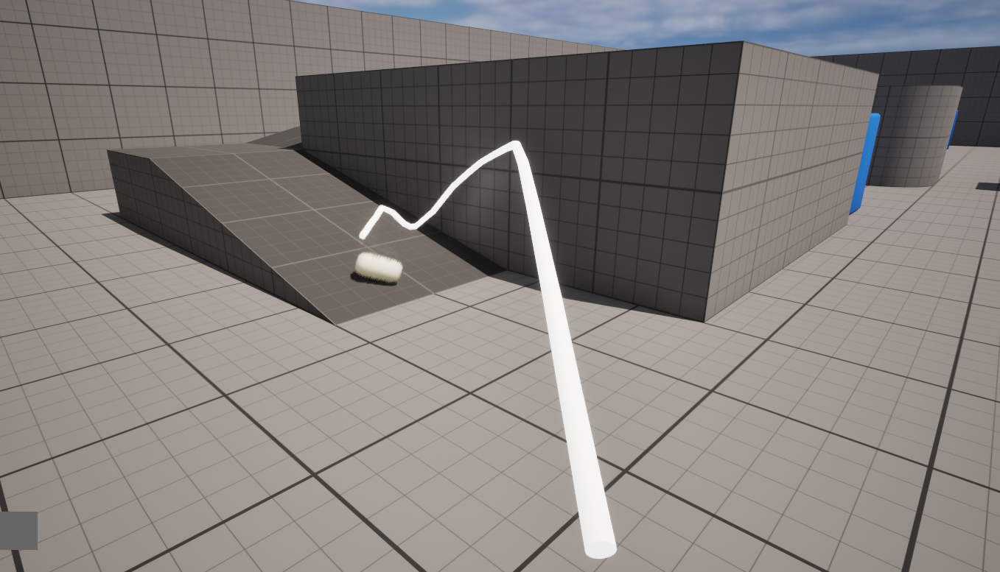

### Blueprint virtual machine

To investigate how BVM (Blueprint Virtual Machine) works I read through the code and visited this two articles: [Anatomy of the Unreal 4 blueprint virtual machine](https://ikrima.dev/ue4guide/engine-programming/blueprints/bp-virtualmachine-overview/), [Discovering Blueprint VM (Part 2)](https://intaxwashere.github.io/blueprint-part-two/).

BVM works in a similar way to JVM - it uses operand stack (it's not the same as the OS stack) to activate zero-address instructions. This instructions use values that are put on stack to perform a limited set of basic actions such as creating a local variable,  jumping to a place in compiled code for BVM. These instructions can be found in the Unreal Engine code in `enum EExprToken`.

One of the features of BVM is stack frame. It allows to call functions, remember functions states, fetch instructions and find corresponding native function (i.e. C++ functions). Stack frames are put on the operand stack one after another (probably they follow some protocol which allows them to put function arguments in a way that can be read by the next stack frame).

To go deeper into details of BVM implementation let's go to the scheme below:

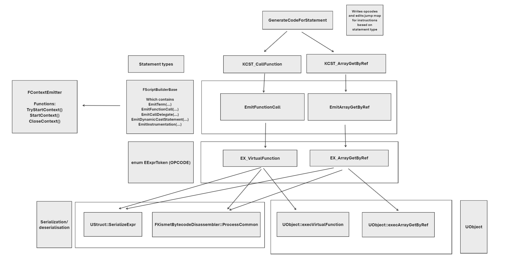

This scheme illustrates connections between different C++ functions and values. If we look at the bottom of this picture we can notice that opcodes are associated with UObject functions. This is interesting, looks like UObject is a unit of BVM execution, in other words - we cannot execute an instruction in a vacuum, it will always be connected to a UObject. For that reason if we want a support from BVM features we should construct our code in Unreal Engine projects based on UObject functionality, not custom C++ code and structures.

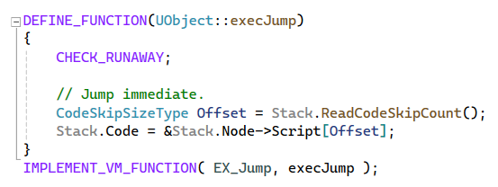

In the left bottom part you can notice a block with serialization/deserialization process.

If we look at the top of the scheme we can see that `GenerateCodeForStatements` can transform terms into opcodes. It also fills `JumpTargetFixupMap` so that jump  targets (jump is a direction of the execution flow in another part of the program) can be later set after all code is generated.

As I understand `GenerateCodeForStatements` is connected to the functions and classes compilation process. This process is described in a separate part of code and consists of multiple steps:

- `FKismetCompilerContext::PrecompileFunction` prunes the function graph, schedules executions of each node, creates UFunction without script code
- `FKismetCompilerContext::CompileFunction` generates executable code
- `FKismetCompilerContext::PostcompileFunction` is called after all functions had CompileFunction called. It includes working with cross-references.

These steps are all a part of `FKismetCompilerContext::CompileFunction` which contains other interesting operations. For example, it generates `LinearExecutionList` out of graph nodes that are just lists of connections and dependencies.

Unreal Engine Editor (UnrealEd in code) has some useful features that are supported in BVM. For example, to operate with breakpoints there is an opcode-related function `UObject::execBreakpoint`. There is also a `FKismetDebugUtilities::OnScriptExecution` which can break execution, show script execution error message, record execution information in trace log, do something with node stepping (it's when you go inside a function called in another function that you are viewing).

To conclude, BVM is a complex system that includes

- compilation of functions out of blueprint graph to create operation codes
- execution of operation codes
- debugging functionality connected to Unreal Engine Editor
- storing operation codes

### Dynamic Stairs

My dynamic stairs blueprint uses construction script to create stairs with parametrized height and width between two arbitrary points. The benefit of using construction script is that you can see the results of generation right in the editor. So, every change you make will be visualized. The negative side of this approach is that runtime cost increases as the generation is not precalucated but rather computed during the game.

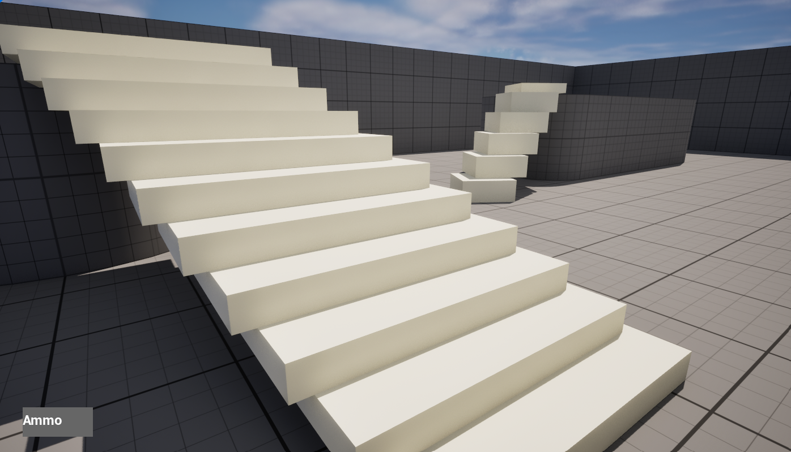

### Configs and Debug console

To change game configurations I use 3 approaches:

- Using FAutoConsoleVariableRef to change values from consol
- Changing ini files (for example, DefaultGame.ini)
- Adding functions with "exec" specifier

I use FAutoConsoleVariableRef to connect Unreal Engine config system with my global C++ value. This value is checked when player tries to shoot from a gun allowing them to shoot infinitely.

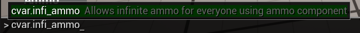

DefaultGame.ini is used to allow infinite health for boxes. I can edit a value from a file like this to change whether this cheat works:

```ini
[CustomVariables]
InfiniteHealth=False
```

The last thing is exec specification for UFUNCTION that allows some classes to execute member functions when a command is printed in command line interface. I created a custom UCheatManager with a function that reloads DefaultGame.ini on fly.

```C++
UFUNCTION(exec)
void ReloadGameConfig()
{
	GEngine->AddOnScreenDebugMessage(-1, 2.0f, FColor::Yellow, TEXT("Reloading game config"));
	FString fileName = GGameIni;
	GConfig->LoadGlobalIniFile(fileName, *GGameIni, NULL, true);
}
```

Without this function the reloading of a DefaultGame.ini requires a reloading of the whole project.
